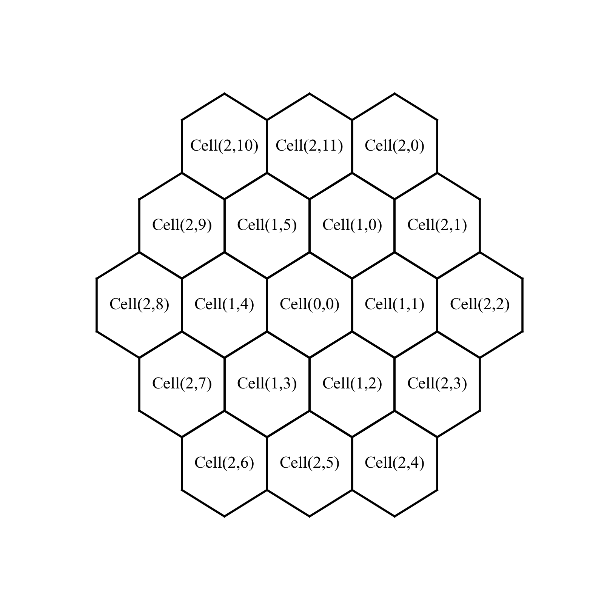

# Hexagonal Lattice Library

Version: 0.1

Developed by LI Zikang in 2023.

This library provides both flexible coordinate system and integrated plotting function for hexagonal lattice geometry, inspired by data post-processing of fast reactors.

## Coordinates
Three coordinate systems are supported, including:
- Cube coordinate
- Ring coordinate
- Offset coordinate

Click [here](https://www.redblobgames.com/grids/hexagons/) for reference to their definitions and properties.

## HexLattice
A class `HexLattice` is provided to describe the structure of a hexagonal lattice.

You can specify the data in each hexagonal cell ring-by-ring or row-by-row as follows. Browse the [examples](examples) for more usage ways.

### Row-by-row
```python
from HexLattice import *

lattice = HexLattice(ring=3, pitch=1.0)
lattice.generate_lattice()
appender = RowAppender(lattice=lattice)

for i in range(appender.cell_num):
    appender.append(key='id', value=i)

lattice.plot(keys='id', text_size=16, max_ring_idx=2)
```

### Ring-by-ring
```python
from HexLattice import *

lattice = HexLattice(ring=5, pitch=1.0)
lattice.generate_lattice()
for r, ring in enumerate(lattice.lattice):
    for k, point in enumerate(ring):
        print(f"({r+1}, {k+1}): {point}")

lattice.plot()
```


